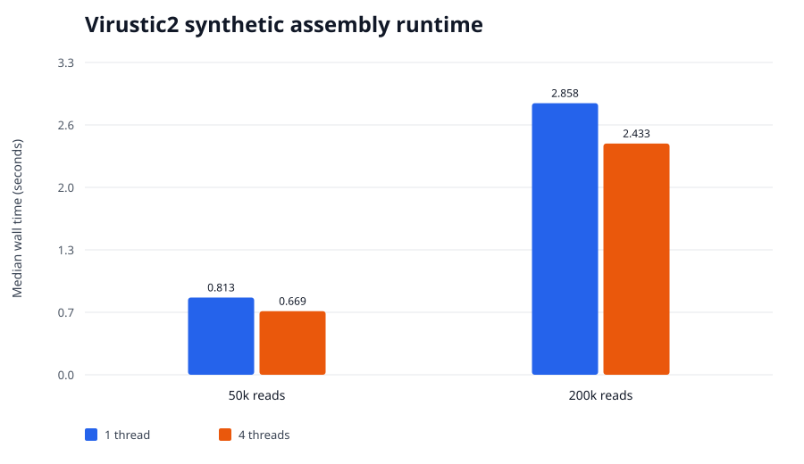

# Synthetic assembly benchmark — 2026-09-03

This benchmark is controlled engineering evidence, not a real-dataset assembler comparison or
biological validation. It measures deterministic assembly of error-free synthetic circular DNA.

## Environment and source

- Host: Apple M2 Max (`Mac14,6`), 12 logical CPUs, 96 GiB RAM, macOS-14.7.6-arm64-arm-64bit, Python 3.12.7, Rust/Cargo 1.98.1
- Virustic2 commit: `cd246638f15f3cd95ede7a20fa125fc01698f8f6`
- Working tree: clean
- Replicates: three independent complete harness invocations

## Workload

The deterministic generator created a 50,000-base circular genome and Q40 single-end reads of
150 bases. Reads were sampled in both orientations. Virustic2 used `k=31`, minimum support 2,
minimum contig length 200, occurrence support, tip clipping disabled, and either one or four
worker threads. Accuracy was evaluated independently using canonical 31-mer precision and recall.

## Results

Times and peak RSS are medians with observed three-run ranges in brackets.

| Reads | Threads | Wall time, s | Peak RSS, MiB | Canonical 31-mer precision | Recall |
|---:|---:|---:|---:|---:|---:|
| 50,000 | 1 | 0.813 [0.791–0.840] | 27.4 [19.1–29.0] | 1.000 | 1.000 |
| 50,000 | 4 | 0.669 [0.661–0.679] | 29.6 [24.9–33.7] | 1.000 | 1.000 |
| 200,000 | 1 | 2.858 [2.853–2.865] | 23.3 [21.3–29.7] | 1.000 | 1.000 |
| 200,000 | 4 | 2.433 [2.427–2.492] | 30.5 [28.5–31.0] | 1.000 | 1.000 |



Across all runs, the one- and four-thread FASTA outputs had identical SHA-256 values for a given
input. Four threads improved median wall time by 1.21× at 50,000 reads and
1.17× at 200,000 reads. The larger four-thread case processed 30 million input bases
in 2.43 seconds, about
12.33 million input bases per second.

## Limitations

- The synthetic genome is repeat-light and the reads are error-free.
- Canonical k-mer recovery is appropriate for this controlled unitig case but is not a substitute
  for reference alignment, misassembly analysis, completeness, strain resolution, or real-read QC.
- The benchmark does not compare Virustic2 with another assembler.
- Three repetitions characterize this host only; they are not universal performance guarantees.
- Thread scaling is modest and should not be described as near-linear.

## Reproduction

Run the `standard` profile of the portfolio benchmark harness with only Virustic2 selected:

```bash
python3 -u benchmark.py run --profile standard --label virustic2-r1 --tool virustic2
```

Run three complete invocations and report the median and full observed range without selecting the
fastest result. Fixture and output SHA-256 values are retained in the machine-readable result file.
